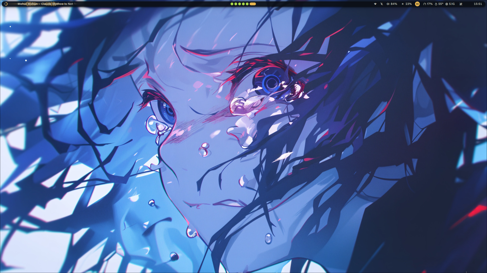
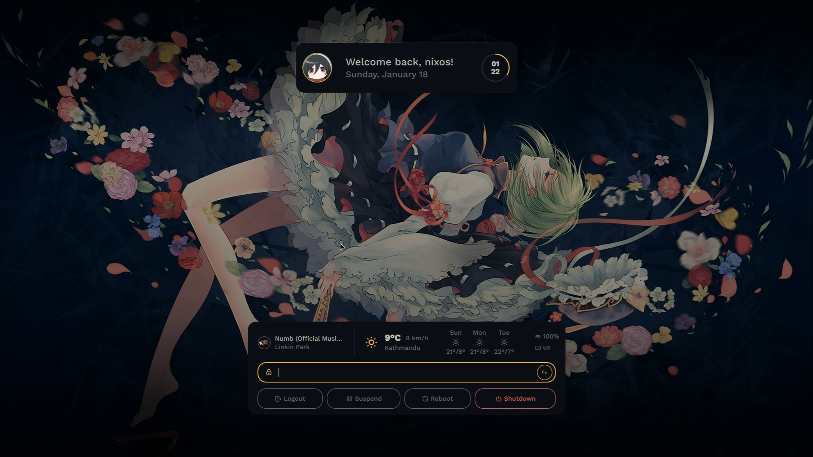
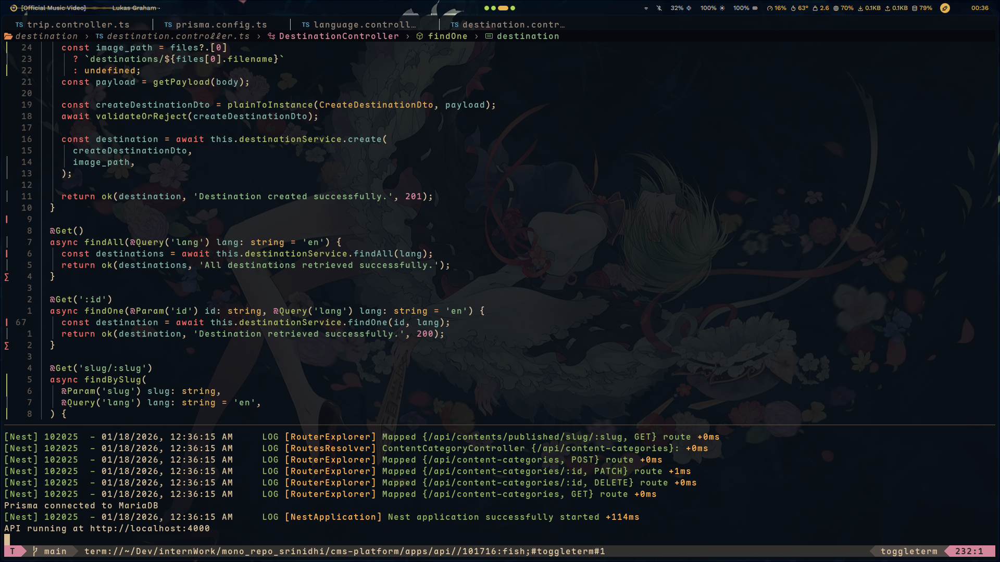
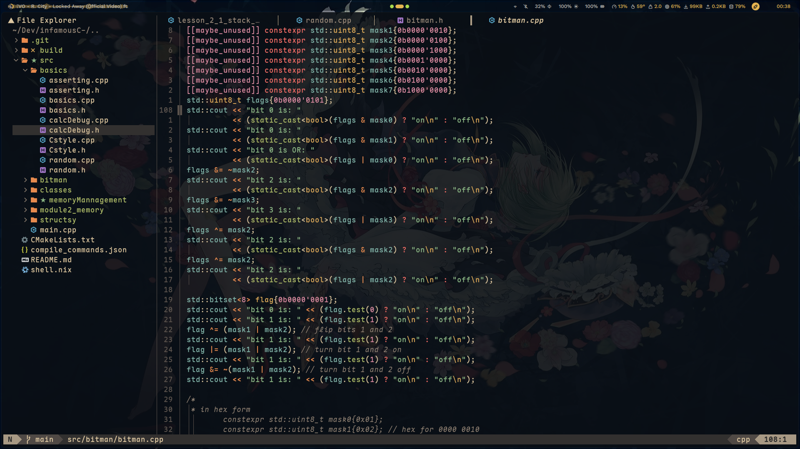

<div align="center">

# ❄️ Hyprland / NixOS Dotfiles

**Stability meets Portability**

[](https://hyprland.org/)
[](https://nixos.org/)
[](https://neovim.io/)

<p align="center">
  <a href="#-showcase">Showcase</a> •
  <a href="#-features">Features</a> •
  <a href="#-structure">Structure</a> •
  <a href="#-installation">Installation</a>
</p>

</div>

---

## 📖 Overview

This repository hosts my personal **NixOS** configuration, built with **Flakes** and **Home Manager**.

**The Philosophy: A Hybrid Setup**

1.  **System Layer (Nix):** The OS, packages, drivers, and services are managed declaratively via Nix for reproducibility and stability.
2.  **User Layer (Dotfiles):** WM configs (Hyprland, Waybar, etc.) remain in standard `.config` format. This ensures the configuration remains portable to other distros (Arch, Fedora) and is easier to edit on the fly without rebuilding the system.

> **Note:** Included `noctalia-shell` integration for Waybar.

---

## 📸 Showcase

### 💠 Desktop Experience

\_Hyprland



### 💻 Development Workflow

_Neovim (Nixvim) with LSP & blink-cmp_

<div align="center">
  
  
</div>

---

## ✨ Features

- **Window Manager:** [Hyprland](https://github.com/hyprwm/Hyprland) (configured via standard `.config` for ease of use).
- **Editor:** [Nixvim](https://github.com/nix-community/nixvim) configured declaratively via **nix**.
  - _Blazing fast completions with `blink-cmp`._
  - _Full LSP support (including `nixd`)._
- **Bar:** noctalia-shell (replaced for waybar).
- **System:** NixOS Flakes + Home Manager.
- **Structure:** Modular host/user separation.

---

###  Editor (Nixvim)

- **Nixvim Configuration** - Declarative Neovim setup
- **Advanced LSP Support** - Nixd, clangd, rust-analyzer, etc.
- **Blazing Completions** - blink-cmp with luasnip
- **Themed UI** - Custom colorscheme matching desktop
  > **NOTE:** You can find the configurations for Neovim (!Nixvim) in NVIM branch but they are very old

---

## 📂 Structure

The configuration is organized to be modular. System internals are Nixified, while UI configs live in `files/` or standard directories.

```lua
.
├── assets/                  # Media for README
├── flake.nix                # Entry point (Hosts & Users defined here)
├── hosts/                   # Machine-specific configurations
│   └── <hostname>/          # e.g., dell/, exodus/
├── modules/                 # Reusable Nix modules
│   ├── nixos/               # System modules (Boot, Network, Desktop)
│   └── home-manager/        # User modules (Programs, Theming)
├── users/                   # User profiles
│   └── <username>/          # e.g., archbishop/
├── pkgs/                    # Custom packages
├── overlays/                # Nixpkgs overlays
└── files/                   # STATIC CONFIGS (.config files)
    └── hypr/                # Hyprland config lives here!
```

---

## For a fresh install or update

```bash
sudo nixos-rebuild switch --flake .#<your-hostname>
```

## Build nixvim config

```bash
nix build in <your-hostname/nixvim dir>
```

---

### ❤️ Credits

    Base: NixOS & Home Manager communities.
    Tools: Hyprland, Neovim (Nixvim), noctalia-shell.

<div align="center">

<i>If you enjoy this config, consider dropping a star!
https://api.visitorbadge.io/api/visitors?path=https://github.com/yourusername/dotfiles&label=Visitors&countColor=%2523263759
</i>

</div>
