<div align="center">

# ✦ hyprFlake ✦

**A declarative Hyprland + NixOS rice, managed entirely through Nix Flakes.**

<br>

[](https://nixos.org)
[](https://hyprland.org)
[](https://github.com/nix-community/nixvim)


<br>

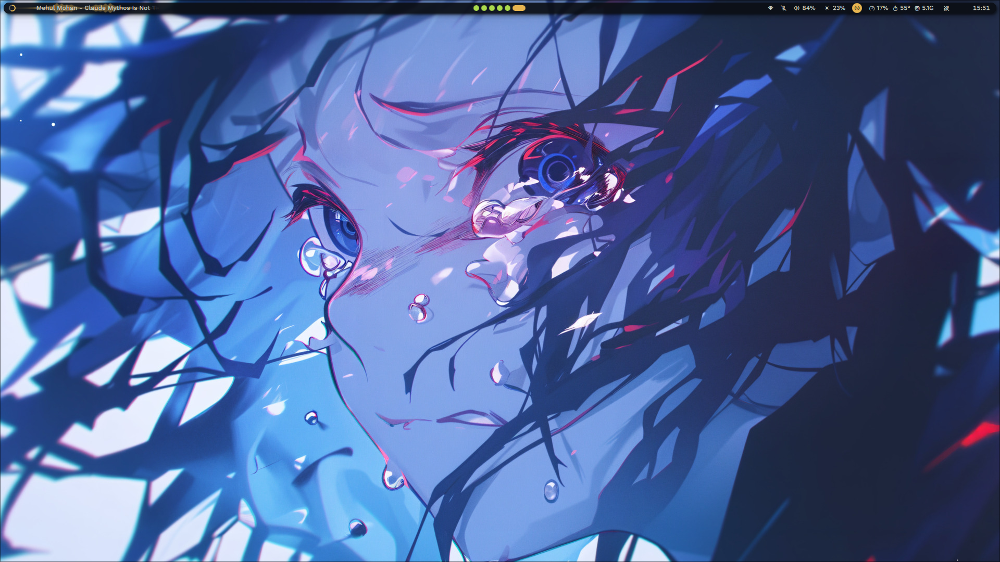

</div>

<br>

## 🖼️ Gallery

<div align="center">

### ✦ Nixvim

_Declaratively configured via [Nixvim](https://github.com/nix-community/nixvim) — not Neovim with lua. Nixvim with Pure Nix._

<table>
<tr>
<td width="50%">
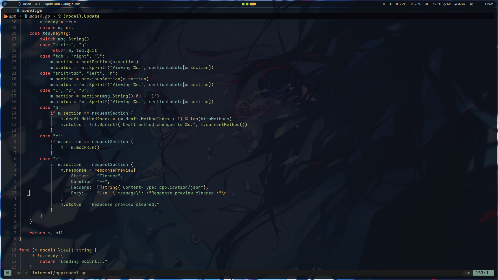
<p align="center"><sub>development environment · transparent background</sub></p>
</td>
<td width="50%">
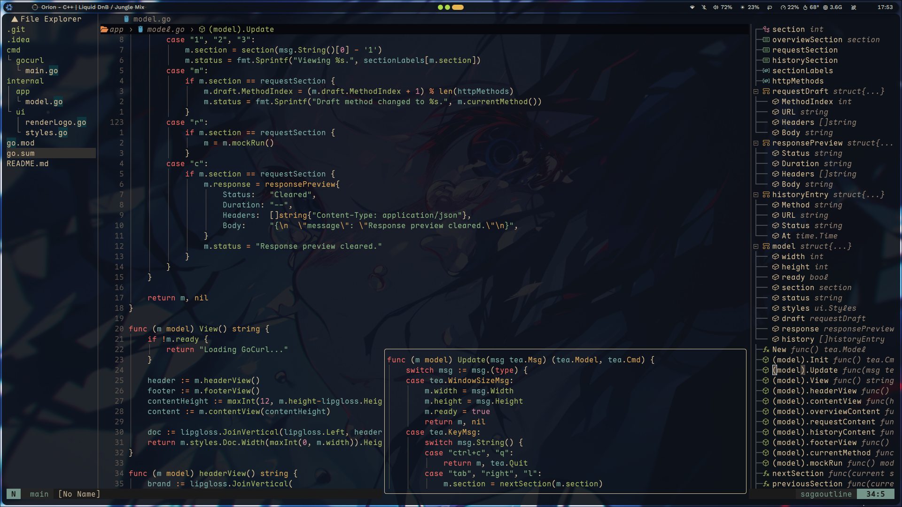
<p align="center"><sub>File explorer · outline panel · saga symbols</sub></p>
</td>
</tr>
<tr>
<td width="50%">
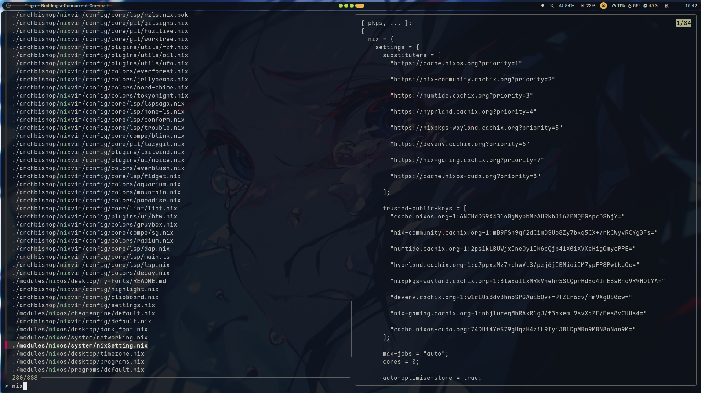
<p align="center"><sub>File searching · telescope / fzf</sub></p>
</td>
<td width="50%">
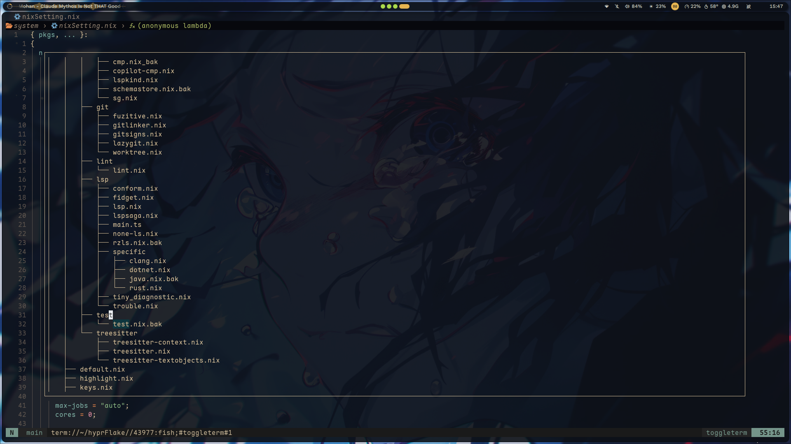
<p align="center"><sub>Nixvim + ToggleTerm — floating terminal overlay with transparency</sub></p>
</td>
</tr>
</table>

<br>

---

### ✦ Terminal & Workflow

<table>
<tr>
<td width="50%">
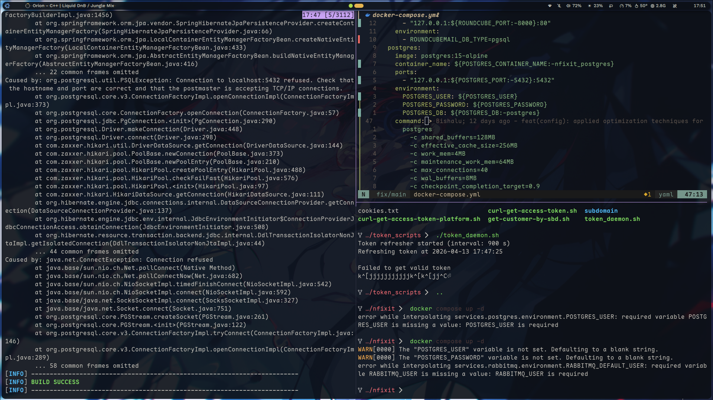
<p align="center"><sub>tmux · split panes · nixvim + docker + spring boot</sub></p>
</td>
<td width="50%">
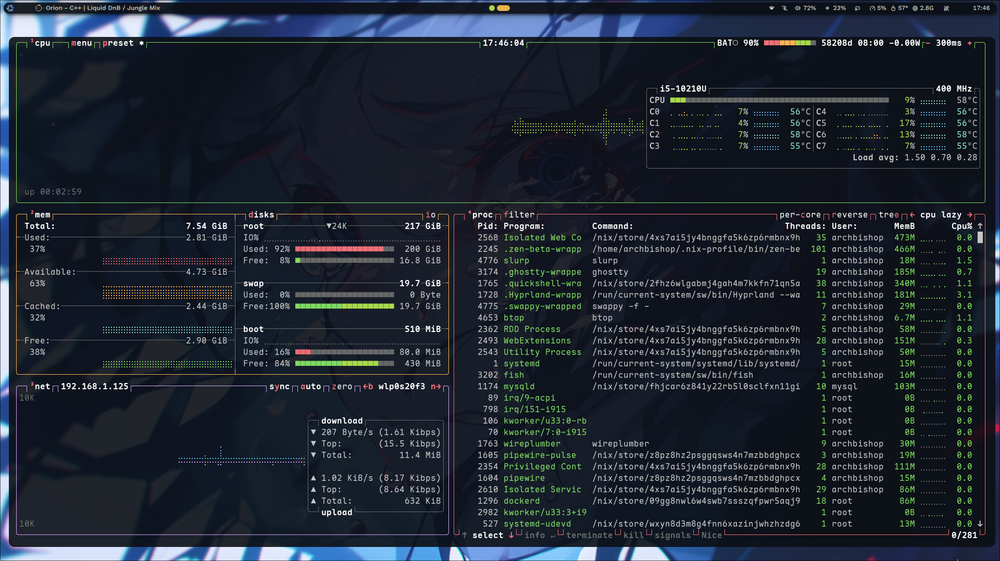
<p align="center"><sub>btop · system monitoring · Ayu theme</sub></p>
</td>
</tr>
</table>

<br>

---

### ✦ PostgreSQL & Database

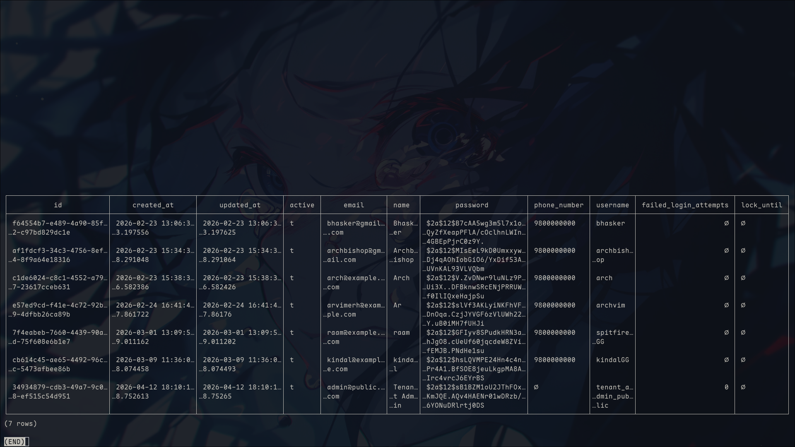
<p align="center"><sub>PostgreSQL queries rendered directly in the terminal · ghostty</sub></p>

<br>

---

### ✦ Desktop & Utilities

<table>
<tr>
<td width="50%">
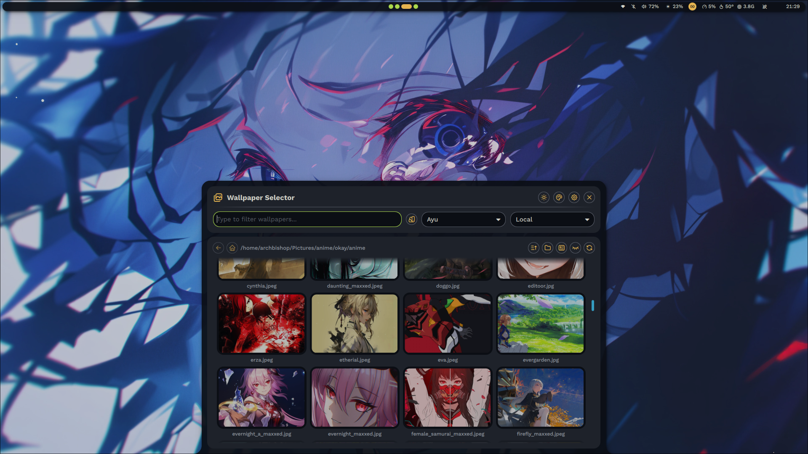
<p align="center"><sub>Waypaper wallpaper selector · anime collection · Ayu theme</sub></p>
</td>
<td width="50%">
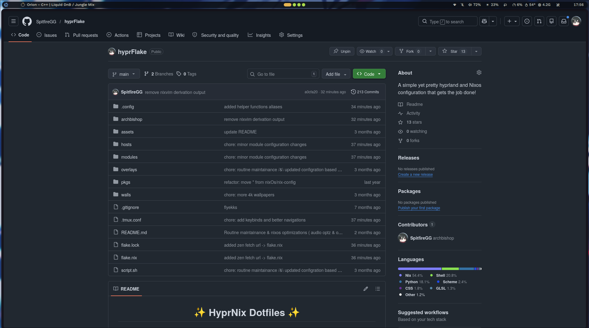
<p align="center"><sub>Zen Browser · minimal chrome · GitHub integration</sub></p>
</td>
</tr>
<tr>
<td colspan="2">
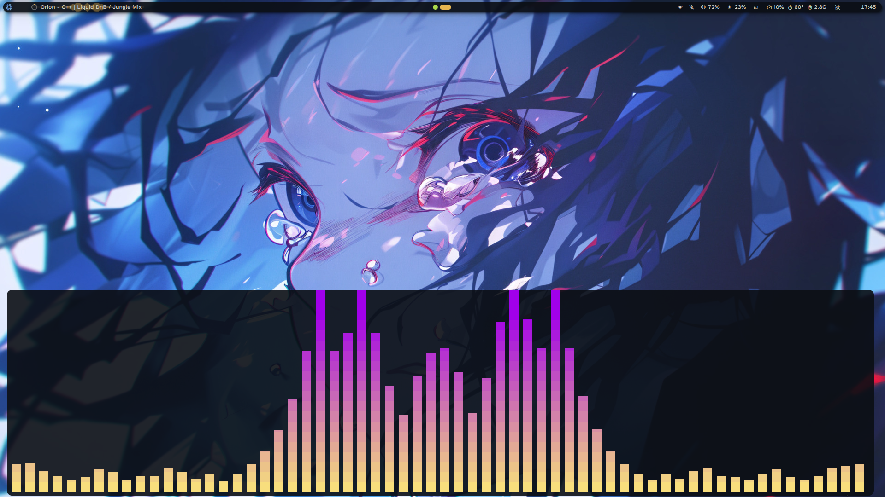
<p align="center"><sub>Cava audio visualizer · smooth gradients</sub></p>
</td>
</tr>
</table>

</div>

<br>

---

## 🧬 Stack

<div align="center">

| Component            | Choice                      |
| :------------------- | :-------------------------- |
| **OS**               | NixOS (unstable)            |
| **WM**               | Hyprland                    |
| **Shell**            | Fish + Starship             |
| **Terminal**         | Ghostty                     |
| **Editor**           | Nixvim (declarative Neovim) |
| **Bar**              | noctalia                    |
| **Browser**          | Zen Browser                 |
| **Notifications**    | noctalia-shell              |
| **Launcher**         | Rofi                        |
| **Wallpaper**        | noctalia                    |
| **System Monitor**   | btop                        |
| **Audio Visualizer** | Cava                        |
| **Multiplexer**      | tmux                        |
| **File Manager**     | Ranger / Thunar             |

</div>

<br>

---

## 📂 Structure

```
.
├── flake.nix              # Entry point — inputs, nixos & home-manager configs
├── flake.lock             # Locked dependency graph
│
├── hosts/                 # Machine-specific configurations
│   └── dell/              # Hardware config, boot, networking
│
├── archbishop/            # User-level config (home-manager)
│   ├── home.nix           # Home-manager entry point
│   └── nixvim/            # Full Nixvim editor configuration
│
├── modules/               # Reusable NixOS & home-manager modules
│   ├── nixos/             # System-level (services, desktop, programs)
│   └── home-manager/      # User-level (programs, theming, dotfiles)
│
├── .config/               # Traditional dotfiles (hyprland, waybar, etc.)
│   ├── hypr/              # Hyprland config
│   ├── waybar/            # Bar config
│   ├── ghostty/           # Terminal config
│   ├── rofi/              # Launcher config
│   ├── cava/              # Audio visualizer config
│   ├── dunst/             # Notification daemon config
│   ├── fish/              # Shell config
│   └── ...                # btop, kitty, swaync, ranger, etc.
│
├── walls/                 # Wallpaper collection (anime / aesthetic)
├── pkgs/                  # Custom package definitions
├── overlays/              # Nixpkgs overlays
└── assets/                # Screenshots for this README
```

> **Note:** Hyprland, and other tool configs live in `.config/` as traditional dotfiles — making them accessible to anyone, regardless of whether they use NixOS.

<br>

---

## 🚀 Installation

```bash
# Clone the repo
git clone https://github.com/SpitfireGG/hyprFlake.git
cd hyprFlake

# Apply NixOS system configuration
sudo nixos-rebuild switch --flake .#archbishop

# Apply home-manager user configuration
home-manager switch --flake .#archbishop
```

> You will need to adapt `hosts/dell/` and `archbishop/` to match your machine and user.

<br>

---

## 🧠 How It Works

1. **`flake.nix`** declares all inputs (nixpkgs, home-manager, nixvim, zen-browser, quickshell) and wires them together.
2. **`hosts/dell/configuration.nix`** pulls in NixOS system modules — boot, networking, services, desktop environment.
3. **`archbishop/home.nix`** configures the user layer through home-manager — programs, dotfiles, theming, **Nixvim**.
4. **`modules/`** contain reusable configuration chunks that any host or user can import.
5. **`.config/`** holds traditional dotfiles for tools that don't need (or benefit from) Nix-level management.

Everything is declarative. Everything is reproducible. Rebuild the entire system from a single `flake.nix`.

<br>

---

<div align="center">

### ✦

_Built on NixOS · Composed in Hyprland · Edited in Nixvim_

If this setup caught your eye, consider dropping a ⭐

</div>
